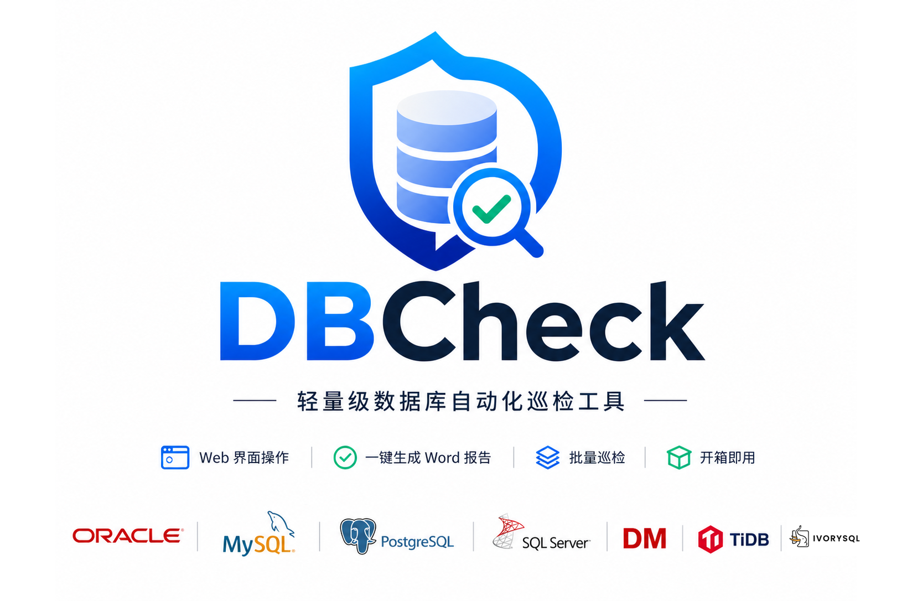
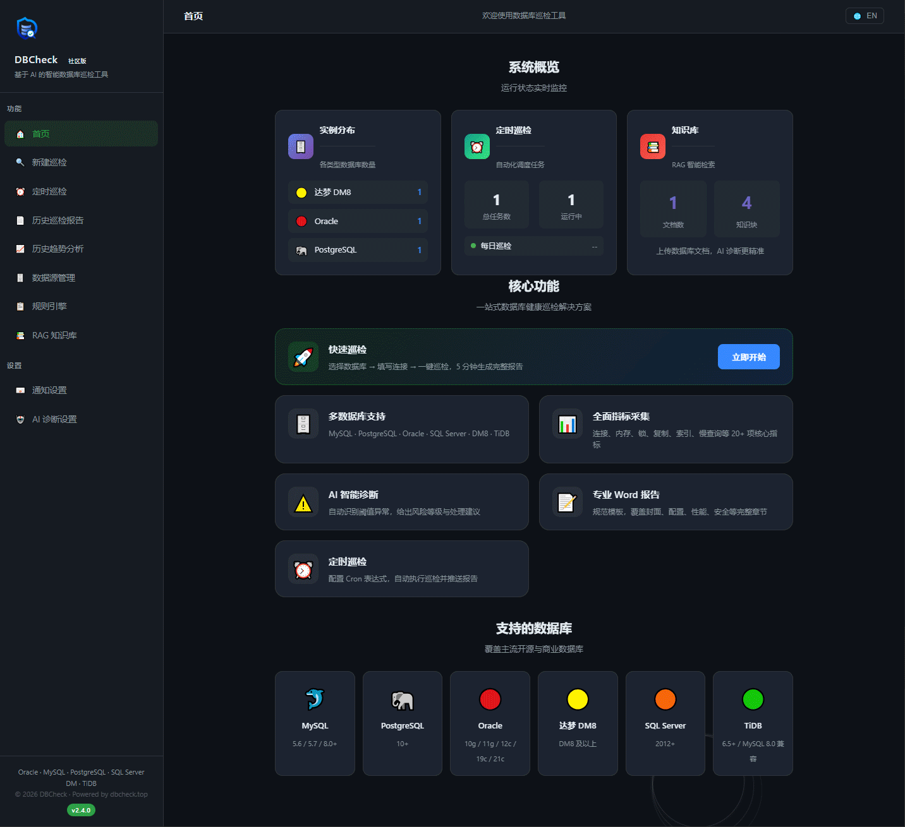
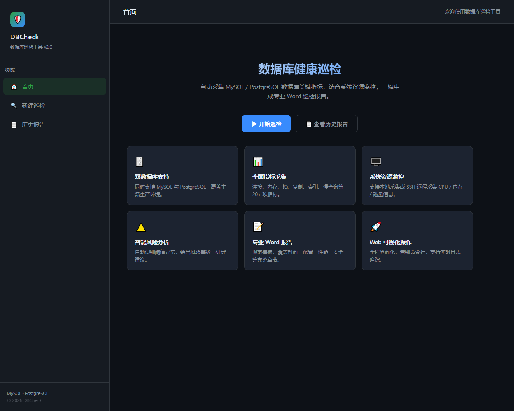
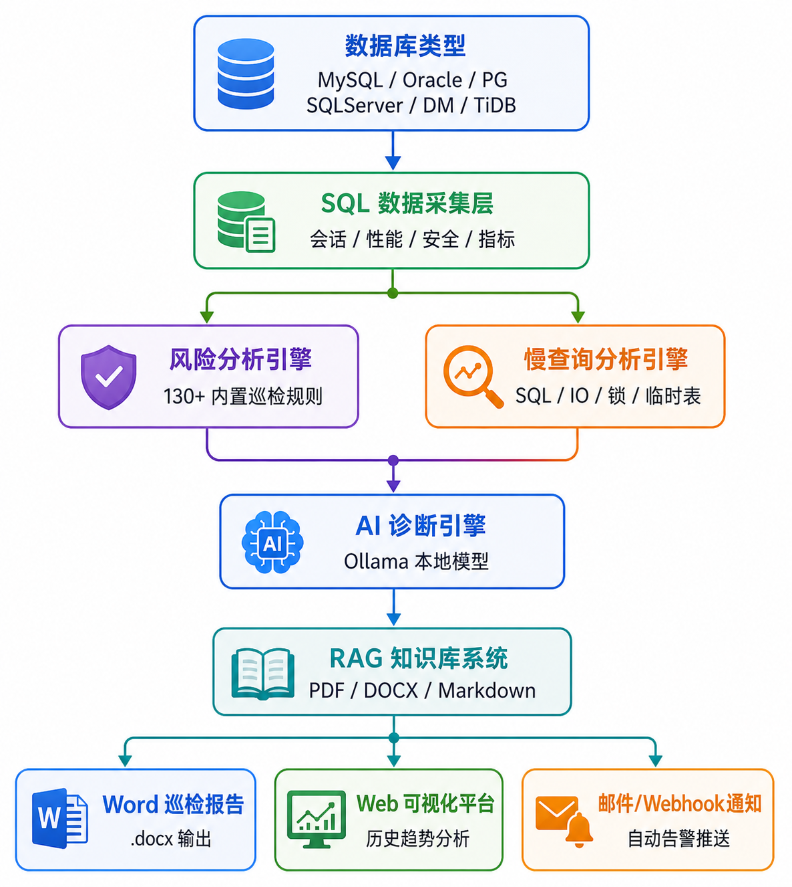
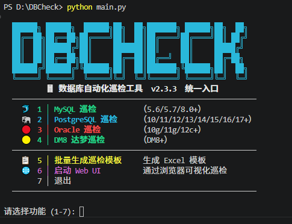
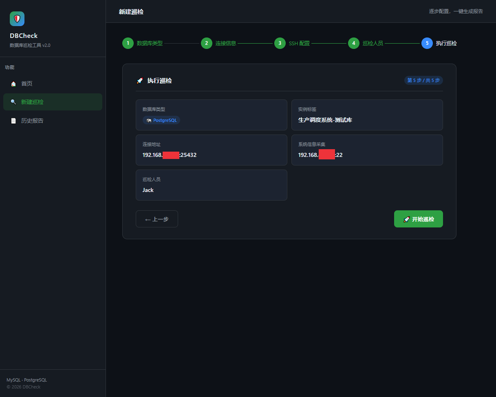
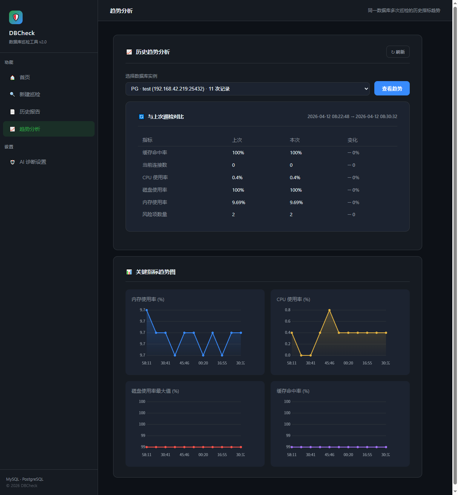
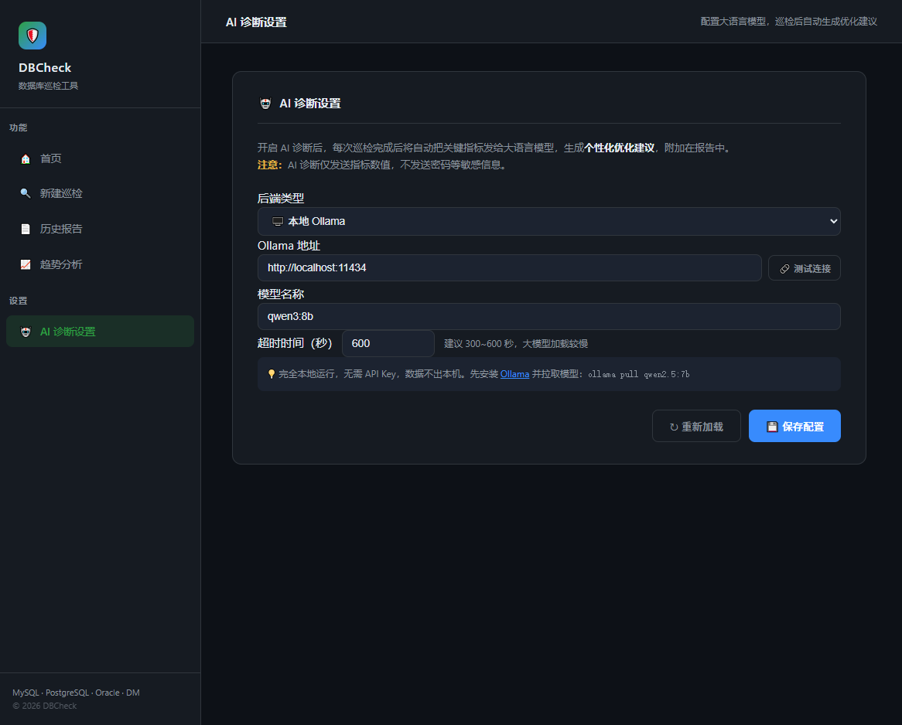
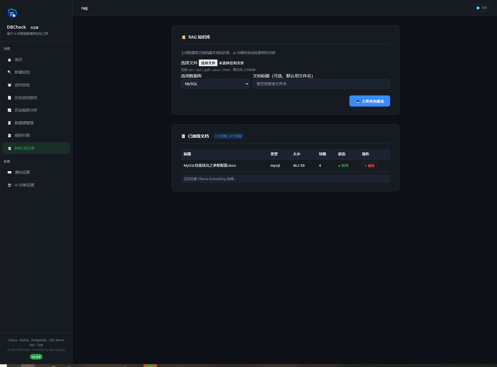
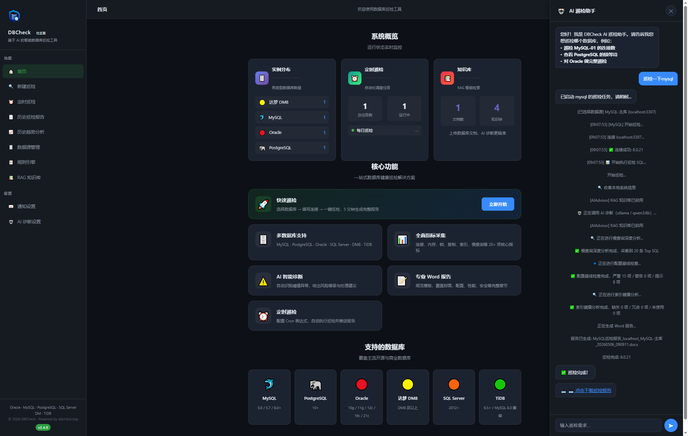

# DBCheck

<p align="center">
  
</p>

<p align="center">

# AI 原生数据库巡检平台

</p>

<p align="center">

开源 · 跨平台 · 自动化 · AI 驱动的数据库健康巡检平台

</p>

---

<p align="center">

[]()
[]()
[]()
[]()
[]()
[]()


</p>

---

# 🌍 详细介绍（多语言支持）

- [中文](README_zh.md)
- [English](README_en.md)

---

# 🚀 什么是 DBCheck？

DBCheck 是一款开源、跨平台 AI 驱动的数据库健康巡检平台。

目前支持：

- MySQL
- PostgreSQL
- Oracle
- SQL Server
- 达梦 DM8
- TiDB

DBCheck 可以自动完成：

✅ 数据库健康巡检  
✅ 系统资源采集  
✅ 风险分析与修复建议  
✅ **一键修复（点击即可执行修复 SQL）**  
✅ Word 巡检报告生成  
✅ 慢查询深度分析  
✅ AI 智能诊断  
✅ RAG 知识库增强  
✅ 历史趋势分析  
✅ Web 可视化管理  
✅ 定时巡检与自动通知  

帮助 DBA 从大量重复、低效、手工巡检工作中解放出来。

---

# 🎬 演示动画
<p align="center">
  
</p>

---

# ✨ 为什么开发 DBCheck？

传统数据库巡检通常存在以下问题：

- DBA 手工执行大量重复 SQL
- 巡检报告依赖人工整理
- 风险发现依赖个人经验
- 缺乏历史趋势分析
- 缺少统一平台管理
- 无法与 AI 能力结合

DBCheck 希望通过：

- 自动化巡检
- AI 智能分析
- 本地离线大模型
- RAG 知识库增强
- 标准化报告
- 趋势分析与通知体系

打造真正的：

# AI 原生数据库运维平台


## Web UI

<p align="center">
  
</p>

---

# 🏗️ 系统架构



---

# ⚡ 快速开始

## 1. 克隆项目

```bash
git clone https://github.com/yourname/DBCheck.git

cd DBCheck
```

---

## 2. 安装依赖

```bash
pip install -r requirements.txt
```

---

## 3. 启动 Web UI

```bash
python web_ui.py
```

浏览器访问：

```text
http://localhost:5003
```

> 🔐 **默认账号**：用户名 `dbcheck`，密码 `dbcheck`。首次登录后请在用户中心修改密码。

---

# 🖥️ 界面截图

## 首页



---

## 数据库巡检



---

## 历史趋势分析



---

## AI 智能诊断



---

## RAG 知识库



---

# 🔥 核心能力

| 功能 | 说明 |
|---|---|
| 💬 AI 对话巡检 | 自然语言一键发起巡检，无需手动操作 |
| 🗄️ 多数据库支持 | MySQL / PostgreSQL / Oracle / SQL Server / DM8 / TiDB |
| 📊 历史趋势分析 | 自动汇总多次巡检数据并生成趋势图 |
| 🤖 AI 智能诊断 | 基于 Ollama 本地大模型分析 |
| 🔍 慢查询深度分析 | SQL / IO / 锁等待 / 临时表综合分析 |
| **🔧 一键修复** | **点击即可执行修复 SQL，无需手动复制粘贴** |
| 📚 RAG 知识库 | 注入企业内部文档增强 AI 诊断 |
| 📧 自动通知 | 邮件 / Webhook 自动推送 |
| 🌐 Web UI | 浏览器可视化操作界面 |
| 📄 Word 报告 | 自动生成专业巡检报告 |
| ⏰ 定时巡检 | 基于 Cron 表达式自动巡检 |
| 🔒 完全离线 AI | 数据不离开本地环境 |

---

# 🤖 AI 能力

DBCheck 深度集成 Ollama 本地大模型。

支持：

- AI 智能诊断
- 慢查询优化建议
- SQL 优化建议
- 风险解释
- 参数配置建议
- RAG 知识增强

推荐模型：

```bash
ollama pull qwen3:30b

ollama pull llama3

ollama pull nomic-embed-text
```

---

# 💬 AI 对话巡检

DBCheck 支持自然语言交互，无需手动操作即可发起巡检。

打开右下角 AI 助手面板，直接输入：

```
巡检 MySQL-主库
对 Oracle 做完整巡检
查看 PostgreSQL 的锁等待
```

系统会自动：

- 解析意图，匹配数据源
- 启动巡检任务
- 实时显示简洁动画进度
- 完成后推送 Word 报告下载链接

<p align="center">
  
</p>

---

# 📚 RAG 知识库

支持上传：

- Oracle 官方文档
- MySQL 运维手册
- 企业内部 SOP
- DBA 运维经验文档

系统会自动：

- 文档分块
- 向量化
- 建立本地向量库
- AI 诊断时自动检索相关知识

支持格式：

- PDF
- DOCX
- Markdown
- TXT
- HTML

---

# 📊 支持的数据库

| 数据库 | 支持状态 |
|---|---|
| MySQL | ✅ |
| PostgreSQL | ✅ |
| Oracle | ✅ |
| SQL Server | ✅ |
| 达梦 DM8 | ✅ |
| TiDB | ✅ |

---

# 🔍 巡检能力

| 巡检项 | MySQL | PG | Oracle | SQLServer | DM8 | TiDB |
|---|---|---|---|---|---|---|
| 会话分析 | ✅ | ✅ | ✅ | ✅ | ✅ | ✅ |
| 内存分析 | ✅ | ✅ | ✅ | ✅ | ✅ | ✅ |
| 慢查询分析 | ✅ | ✅ | ✅ | ✅ | ✅ | ✅ |
| 安全审计 | ✅ | ✅ | ✅ | ✅ | ✅ | ✅ |
| 历史趋势分析 | ✅ | ✅ | ✅ | ✅ | ✅ | ✅ |
| AI 智能诊断 | ✅ | ✅ | ✅ | ✅ | ✅ | ✅ |
| RAG 知识增强 | ✅ | ✅ | ✅ | ✅ | ✅ | ✅ |
| 备份检查 | — | — | ✅ | ✅ | ✅ | — |
| RAC / ASM | — | — | ✅ | — | — | — |

---

# 🧠 AI + DBA = 未来

DBCheck 不只是一个数据库巡检脚本。

它正在逐步演进为：

# AI 原生数据库运维平台

未来规划包括：

- Kubernetes 支持
- Redis 巡检
- MongoDB 巡检
- Prometheus 集成
- 多用户权限系统
- 分布式巡检架构
- AI 自动优化建议

---

# 📦 部署方式

## 源码运行

```bash
python main.py
```

---

## 打包为独立程序

```bash
pyinstaller dbcheck.spec
```

---

# 📈 项目路线图

## 当前已完成

- [x] MySQL 巡检
- [x] PostgreSQL 巡检
- [x] Oracle 深度巡检
- [x] SQL Server 巡检
- [x] DM8 巡检
- [x] TiDB 巡检
- [x] AI 智能诊断
- [x] 慢查询分析
- [x] 历史趋势分析
- [x] RAG 知识库
- [x] 定时任务
- [x] Webhook 通知
- [x] AI 对话巡检（自然语言交互）

## 下一步计划

- [ ] Redis 支持
- [ ] MongoDB 支持
- [ ] Prometheus 集成
- [ ] Docker 一键部署
- [ ] Kubernetes Operator
- [ ] RBAC 权限体系
- [ ] 分布式巡检集群

---

# 🤝 参与贡献

欢迎提交：

- Issue
- Pull Request
- 功能建议
- 巡检规则
- AI 优化建议
- UI 改进方案

一起完善 DBCheck。

---

# ❤️ 鸣谢

特别感谢以下项目：

- [Zhh9126/MySQLDBCHECK](https://github.com/Zhh9126/MySQLDBCHECK.git)
- [Zhh9126/SQL-SERVER-CHECK](https://github.com/Zhh9126/SQL-SERVER-CHECK.git)

---

# 🔗 REST API（v2.4.3+）

DBCheck 提供 REST API 供 CI/CD、监控系统等外部工具调用。需在 Web UI 的 **API Key 管理** 页面创建密钥后使用。

```bash
# 健康检查
curl http://localhost:5003/api/v1/health

# 触发巡检
curl -X POST http://localhost:5003/api/v1/inspect \
  -H "X-API-Key: YOUR_API_KEY" -H "Content-Type: application/json" \
  -d '{"db_type":"mysql","host":"192.168.1.100","port":3306,"user":"root","password":"****"}'

# 查询结果
curl -H "X-API-Key: YOUR_API_KEY" http://localhost:5003/api/v1/inspect/{task_id}
```

| 参数 | 说明 |
|------|------|
| `db_type` | mysql / pg / oracle / dm / sqlserver / tidb |
| `mode` | sync=同步等待 / async=返回task_id |
| `ssh` | SSH 跳板 `{host, port, user, password}` |
| `timeout` | 同步超时秒数（默认300） |

安全建议：生产环境使用 HTTPS 反向代理，定期轮换 API Key。

---

# ☕ 捐赠支持

如果 DBCheck 对你的工作有所帮助，欢迎支持项目持续迭代。

<p align="center">
  
</p>

> 捐赠时备注你的名字或昵称，让我们知道谁在支持这个项目 ❤️
> 
> 官方网站：https://dbcheck.top
> 
> 联系邮箱：sdfiyon@gmail.com

## 捐赠者名单

感谢每一位支持者的信任与鼓励！❤️

| 日期 | 姓名/昵称 | 留言 |
|------|-----------|------|
| 2026-4-28 | *ck | |
| 2026-4-29 | *嵘 | |
| 2026-5-4 | **政 | |
| *期待你的支持！* | | |

> 如已捐赠但未出现在此名单中，请联系 sdfiyon@gmail.com 补充。

---

# 🌐 官方网站

https://dbcheck.top

---

# 📧 联系方式

sdfiyon@gmail.com

---

# ⭐ Star History

如果 DBCheck 对你有帮助，欢迎点一个 Star ⭐

你的支持，是项目持续迭代最大的动力。