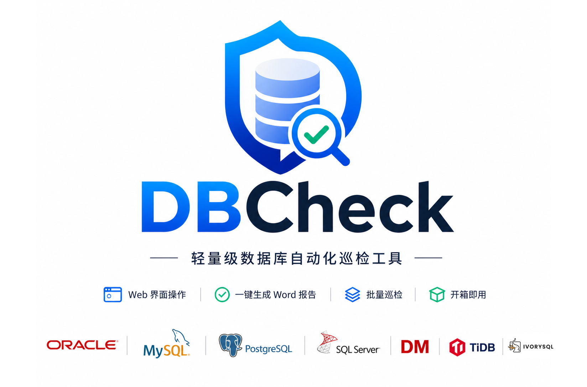
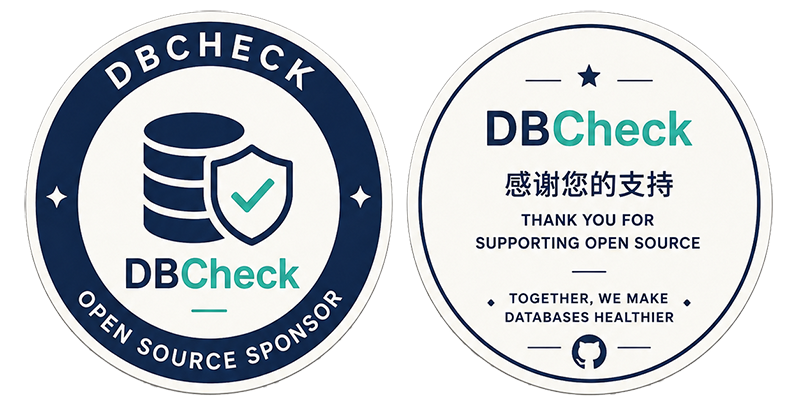

# 🦝 RaccoonX



### Open Source Intelligent Database Inspection & Operations Platform

> **RaccoonX** is an open-source, cross-platform database inspection and operations platform designed for DBAs, database engineers, DevOps teams, and infrastructure teams.
>
> Formerly known as **DBCheck**.

[]()
[](./LICENSE)
[]()
[]()
[]()
[]()
[](https://hub.docker.com/r/jackge12345/dbcheck)
[](https://github.com/fiyo/DBCheck/stargazers)
[](https://github.com/fiyo/DBCheck/network/members)

> 🐳 **25,000+ Docker image pulls**
> 🗄️ **21+ database types**
> 🔍 **330+ inspection rules**
> 🤖 **AI-assisted diagnostics**
> 🔌 **Extensible plugin architecture**
> 📜 **Apache License 2.0**

If RaccoonX is useful to you, consider giving the repository a ⭐.

A Star helps more database engineers discover the project and is one of the simplest ways to support an independent open-source project.

---

## 🌐 Project Links

* **Website:** https://raccoonx.cn/
* **GitHub:** https://github.com/fiyo/DBCheck
* **Docker Hub:** https://hub.docker.com/r/jackge12345/dbcheck
* **English:** `README.md`
* **中文:** [README_zh.md](./README_zh.md)
* **Issues:** https://github.com/fiyo/DBCheck/issues
* **Discussions:** https://github.com/fiyo/DBCheck/discussions

---

# 🦝 Why RaccoonX?

Database environments are becoming increasingly complex.

A typical production environment may contain:

* MySQL
* PostgreSQL
* Oracle
* SQL Server
* DM8
* TiDB
* OceanBase
* Redis
* MongoDB
* ClickHouse
* and many other database systems.

Traditional database inspection often depends on manually executing SQL scripts, checking operating-system resources, collecting screenshots, analyzing slow SQL, and writing inspection reports.

RaccoonX tries to bring these tasks together into one open-source platform.

### RaccoonX helps you:

```text
Connect
   ↓
Inspect
   ↓
Collect
   ↓
Analyze
   ↓
Identify Risks
   ↓
Generate Reports
   ↓
Track Changes
   ↓
AI-assisted Diagnosis
```

It can be used as a standalone database inspection tool or as part of a broader database operations workflow.

---

# 📊 Project Milestones

RaccoonX started as **DBCheck** and has evolved through continuous development and community feedback.

| Milestone          |         Status |
| ------------------ | -------------: |
| Docker image pulls |    **25,000+** |
| GitHub Stars       |       **166+** |
| GitHub Forks       |        **57+** |
| Database types     |        **21+** |
| Inspection rules   |       **330+** |
| Languages          |          **9** |
| License            | **Apache 2.0** |

Docker pull counts represent image pulls and should not be interpreted as the number of unique users or installations.

### ⭐ Help us reach the next milestone

If you have used RaccoonX, tested it, learned from it, or simply find the project interesting:

**Give it a Star.**

```text
25,000+ Docker Pulls
        ↓
   Keep Building
        ↓
   ⭐ Star RaccoonX
```

---

# ✨ Features at a Glance

| Feature                      | Description                                                                                  |
| ---------------------------- | -------------------------------------------------------------------------------------------- |
| 🗄️ Data Source Manager      | Unified management of database instances, grouping, batch inspection, CSV import/export      |
| 📋 Database Inspection       | 21+ database types and 330+ inspection rules with automated Word reports                     |
| 🔌 Plugin System             | Independent plugin lifecycle, plugin data, templates, baselines and rules                    |
| 🔍 Slow Query Analysis       | Execution plans, I/O patterns, lock waits and AI-assisted analysis                           |
| 🔒 Lock Diagnostics          | Blocking chains, deadlocks, long transactions and remediation suggestions                    |
| 📊 Index Health              | Missing, redundant and long-unused index analysis                                            |
| ⚙️ Configuration Baseline    | Compare database parameters against configurable recommended values                          |
| 📈 Historical Analysis       | Multi-round inspection history, trends and before/after comparisons                          |
| 🤖 AI Diagnostics            | Local Ollama or compatible cloud APIs for AI-assisted analysis                               |
| 💬 AI Inspection Chat        | Natural-language interaction with the inspection system                                      |
| 📡 Real-time Monitoring      | Connections, latency, throughput and availability monitoring                                 |
| 🖥️ Server Inspection        | CPU, memory, disk, network, services and processes                                           |
| 🔗 Shareable Reports         | Generate report links that can be viewed without login                                       |
| ⏰ Scheduled Tasks            | Cron-based inspection with Email/Webhook notifications                                       |
| 📚 RAG Knowledge Base        | Upload operational documentation for AI-assisted diagnosis                                   |
| 📊 Oracle AWR Analysis       | Parse Oracle AWR HTML reports and generate structured reports                                |
| 💿 DM8 Offline Storage Check | Analyze DM8 data files without a running database                                            |
| 📝 SQL Editor                | Interactive SQL editor with syntax highlighting and execution history                        |
| 🖥️ Remote Terminal          | SSH terminal with multi-tab and fullscreen support                                           |
| 💾 Disaster Recovery Backup  | Scheduled database/file backups with retention and health tracking                           |
| 🌍 Multi-language UI         | Chinese, English, Traditional Chinese, Japanese, Korean, Spanish, French, German and Russian |

---

# 🗄️ Supported Databases

RaccoonX currently supports **21+ database and data systems**.

| Database      | Driver                  | Default Port | Notes                      |
| ------------- | ----------------------- | -----------: | -------------------------- |
| MySQL         | pymysql                 |         3306 | 5.6 / 5.7 / 8.0+           |
| MariaDB       | pymysql                 |         3306 | 10.3+                      |
| PostgreSQL    | psycopg2                |         5432 | 10+                        |
| Oracle        | oracledb                |         1521 | 11g R2 / 12c / 19c / 21c+  |
| Oracle (JDBC) | JPype1 + ojdbc          |         1521 | Oracle JDBC connection     |
| SQL Server    | pyodbc + ODBC Driver 17 |         1433 | 2012+                      |
| DM8           | dmpython                |         5236 | Dameng                     |
| TiDB          | pymysql                 |         4000 | MySQL protocol             |
| IvorySQL      | psycopg2                |         5333 | PostgreSQL compatible      |
| YashanDB      | yashandb                |         1688 | Oracle compatible          |
| KingbaseES    | psycopg2                |        54321 | PostgreSQL compatible      |
| GBase 8s      | JDBC                    |         9088 | JDK + JDBC                 |
| UXDB          | JDBC                    |        33060 | PostgreSQL compatible      |
| HGDB          | JDBC                    |         5866 | PostgreSQL compatible      |
| MongoDB       | pymongo                 |        27017 | 4.0+                       |
| DB2 LUW       | JDBC                    |        50000 | 11.5+ / 12.x               |
| OceanBase     | pymysql                 |         2881 | MySQL tenant               |
| TDSQL-C MySQL | pymysql                 |         3306 | MySQL compatible           |
| Redis         | redis-py                |         6379 | 3.0+                       |
| Redis Cluster | redis-py                |         6379 | Cluster topology and slots |
| ClickHouse    | JDBC                    |         8123 | 21.8+                      |

> **Oracle JDBC**
>
> Oracle JDBC is implemented as an independent plugin using JPype and the Oracle JDBC driver. It is useful in environments where Oracle Instant Client cannot be installed.

---

# 🚀 Quick Start

## 🐳 Docker — Recommended

Docker is the easiest way to start RaccoonX.

### Docker Hub

```bash
docker pull jackge12345/dbcheck:latest

docker run -d \
  -p 5003:5003 \
  -v dbcheck_data:/app/data \
  -v dbcheck_reports:/app/reports \
  --name dbcheck \
  jackge12345/dbcheck:latest
```

### GitHub Container Registry

```bash
docker pull ghcr.io/fiyo/dbcheck:latest

docker run -d \
  -p 5003:5003 \
  -v dbcheck_data:/app/data \
  -v dbcheck_reports:/app/reports \
  --name dbcheck \
  ghcr.io/fiyo/dbcheck:latest
```

Open:

```text
http://localhost:5003
```

Default credentials:

```text
Username: admin
Password: admin123
```

Please change the password after the first login.

---

## 🐳 Docker Compose

```bash
curl -o deploy/docker-compose.yml \
  https://raw.githubusercontent.com/fiyo/DBCheck/main/deploy/docker-compose.yml

docker compose -f deploy/docker-compose.yml up -d
```

> **GBase 8s**
>
> The Docker image includes the required JDK and JDBC driver. GBase 8s can be used without additional driver installation when running through the provided image.

---

# 💻 Source Installation

## Requirements

* Python 3.10+
* Git
* Database-specific Python drivers
* Additional JDBC / ODBC dependencies where required

Clone the repository:

```bash
git clone https://github.com/fiyo/DBCheck.git
cd DBCheck
```

Install dependencies:

```bash
pip install -r deploy/requirements.txt
```

Start the Web UI:

```bash
python web_ui.py
```

Open:

```text
http://localhost:5003
```

---

## CLI Mode

Chinese interface:

```bash
python -m entrypoints.cli
```

English interface:

```bash
python -m entrypoints.cli --lang en
```

Web interface:

```bash
python web_ui.py
```

---

# 🔍 Database Inspection

RaccoonX provides configuration-driven database inspection.

The inspection engine collects database metadata, configuration, performance information, resource usage and security-related information, then evaluates them against inspection rules.

Typical workflow:

```text
Database
   │
   ├── Connection
   │
   ├── Metadata
   │
   ├── Configuration
   │
   ├── Performance
   │
   ├── Sessions
   │
   ├── Locks
   │
   ├── Storage
   │
   ├── Security
   │
   └── SQL
          ↓
    Inspection Engine
          ↓
     Risk Analysis
          ↓
    Recommendations
          ↓
      Word Report
```

---

# 📋 Inspection Coverage

RaccoonX includes database-specific inspection templates.

Typical inspection dimensions include:

| Dimension         | Coverage                                        |
| ----------------- | ----------------------------------------------- |
| Basic Information | Version, instance, database information         |
| Sessions          | Active sessions and connection usage            |
| Memory            | Memory configuration and utilization            |
| Storage           | Tablespaces, files and capacity                 |
| Configuration     | Important database parameters                   |
| Security          | Users, privileges and security configuration    |
| SQL               | Top SQL and slow queries                        |
| Locks             | Blocking sessions and lock waits                |
| Replication       | Replication / Data Guard status where supported |
| Backup            | Backup readiness and related configuration      |
| Statistics        | Object and optimizer statistics                 |
| Performance       | Database performance indicators                 |
| Availability      | Database and service status                     |

Coverage varies by database type.

---

# 📊 Word Inspection Reports

RaccoonX can automatically generate structured Word inspection reports.

A typical Oracle report contains:

| Chapter      | Content                                                                  |
| ------------ | ------------------------------------------------------------------------ |
| Cover        | Database name, version, host, inspector and timestamp                    |
| Chapter 1    | OS host information                                                      |
| Chapter 2    | Database basic information                                               |
| Chapter 3    | Tablespaces                                                              |
| Chapter 4    | SGA / PGA                                                                |
| Chapter 5    | Key parameters                                                           |
| Chapter 6–19 | Undo, Redo, Archive, DG, RAC, ASM, Sessions, Performance, Security, etc. |
| Chapter 20   | Risks & Recommendations                                                  |
| Chapter 21   | AI Diagnostic Suggestions                                                |
| Chapter 22   | Report Notes                                                             |

Report chapters can be configured through the Web UI.

---

# ⚠️ Intelligent Risk Analysis

RaccoonX evaluates collected information against configurable inspection rules.

A risk item can contain:

* Risk description
* Current value
* Recommended value
* Risk level
* Related SQL
* Recommended action
* Executable SQL where applicable

Example workflow:

```text
Detected Risk
     ↓
Understand the Risk
     ↓
View Recommendation
     ↓
Review SQL
     ↓
Confirm
     ↓
Execute Fix
```

Dangerous operations such as:

```text
DELETE
DROP
TRUNCATE
```

require secondary confirmation.

All execution operations are logged.

> Risk recommendations are reference information. Always evaluate changes against your actual production architecture, workload and business requirements before execution.

---

# 🐢 Deep Slow Query Analysis

RaccoonX can analyze slow or expensive SQL using multiple dimensions.

Analysis may include:

* SQL text
* Execution plan
* Execution time
* CPU usage
* I/O behavior
* Lock waits
* Index usage
* Execution frequency
* Resource consumption
* Historical information
* AI-assisted diagnosis

The goal is to connect SQL symptoms with database and system evidence rather than looking at SQL text alone.

---

# 🔒 Lock & Blocking Diagnostics

Lock analysis provides information such as:

* Blocking sessions
* Blocked sessions
* Blocking chains
* Lock waits
* Long transactions
* Deadlock statistics
* Session relationships
* Suggested remediation actions

For supported databases, remediation SQL can be generated directly from the risk analysis interface.

---

# 📊 Index Health Analysis

RaccoonX analyzes index-related conditions including:

* Potentially missing indexes
* Redundant indexes
* Long-unused indexes
* Index statistics
* Index-related SQL performance issues

Recommendations should always be reviewed against actual workload characteristics before applying changes.

---

# ⚙️ Configuration Baseline

RaccoonX provides configurable baseline management.

The Web UI can be used to define:

* Recommended values
* Thresholds
* Compliance rules
* Database-specific configuration
* Inspection rules

Examples include:

```text
MySQL
PostgreSQL
Oracle
SQL Server
DM8
TiDB
YashanDB
KingbaseES
GBase 8s
MongoDB
ClickHouse
```

The baseline engine compares actual database parameters with configured recommendations.

---

# 📈 Historical Trend Analysis

Inspection results can be retained locally and analyzed over multiple inspection rounds.

Historical analysis can show:

* Resource trends
* Configuration changes
* Risk changes
* Performance changes
* Before / after comparisons
* Risk evolution over time

This makes it possible to move from:

```text
One-time Inspection
```

to:

```text
Continuous Database Health Tracking
```

---

# 📡 Real-time Monitoring

The Web UI provides real-time monitoring for supported database types.

Typical metrics include:

* Response latency
* QPS / TPS
* Active connections
* Total connections
* Running sessions
* Availability
* Slow queries
* Active connection heatmaps

The monitoring dashboard automatically adapts to the capabilities of each database type.

For database types without deep metrics support, RaccoonX can provide TCP-level connectivity information including:

* Reachable / unreachable timeline
* Availability percentage
* Authentication failure
* Port unreachable
* Circuit-breaker state
* Unsupported deep-collection status

---

# 🔥 Slow Query & Connection Heatmap

The monitoring interface provides heatmap visualization for:

* Slow queries
* Active connections
* Time distribution
* Connection activity

Auto-refresh can be configured between:

```text
5s – 60s
```

CSV export is also supported.

---

# 🤖 AI Smart Diagnostics

RaccoonX supports AI-assisted database diagnostics.

The AI layer can analyze inspection results and provide:

* Risk explanations
* Possible root causes
* Optimization suggestions
* SQL analysis
* Configuration suggestions
* Operational recommendations

## Local AI with Ollama

For environments where database information should remain local:

```bash
ollama pull qwen3:30b
ollama pull nomic-embed-text
```

Then start RaccoonX:

```bash
python web_ui.py
```

Configure the AI backend from the AI Settings page.

### Supported AI Backends

| Backend    | Description                  |
| ---------- | ---------------------------- |
| `ollama`   | Local AI deployment          |
| `openai`   | OpenAI-compatible cloud APIs |
| `disabled` | Disable AI                   |

When using Ollama, inspection data can remain within the local environment.

> AI-generated recommendations should be reviewed by qualified database engineers before being applied to production systems.

---

# 💬 AI Chat Inspection

RaccoonX includes an AI interaction panel in the Web UI.

Instead of navigating through every inspection option manually, users can interact with the inspection workflow using natural language.

For example:

```text
Show me the databases with the highest connection usage.

Analyze the slow SQL of this instance.

What are the highest-risk configuration items?

Explain why this database has high I/O.

Compare the current inspection with the previous inspection.
```

Available capabilities depend on the configured database and AI backend.

---

# 📚 RAG Knowledge Base

RaccoonX includes a local knowledge-base capability.

Supported document types include:

* PDF
* Word
* Markdown
* TXT

Documents can be vectorized and retrieved during AI diagnosis.

Typical workflow:

```text
Upload Documentation
        ↓
Vectorization
        ↓
Knowledge Retrieval
        ↓
Database Inspection
        ↓
AI Diagnosis
        ↓
Context-aware Suggestions
```

This allows organizations to combine database inspection data with their own operational documentation and standards.

---

# 🔌 Plugin Architecture

RaccoonX uses an extensible plugin architecture.

Plugins can manage their own:

* Lifecycle
* Metadata
* Inspection templates
* Baselines
* Rules
* Plugin-specific data

Typical plugin structure:

```text
plugins/available/your_plugin/
├── plugin.json
├── main_plugin.py
├── template_data.json
├── baseline_data.json
└── rules/
```

A plugin can be installed, enabled, disabled and uninstalled through the Web UI.

---

## Built-in Plugins

| Plugin        | Database                      | Description                                          |
| ------------- | ----------------------------- | ---------------------------------------------------- |
| MongoDB       | MongoDB 4.0+                  | Connection status, database statistics, slow queries |
| Oracle JDBC   | Oracle 11g / 12c / 19c / 21c+ | JDBC-based Oracle inspection                         |
| DB2 JDBC      | DB2 LUW 11.5+ / 12.x          | JDBC inspection and system catalog analysis          |
| Redis         | Redis 3.0+                    | Memory, clients, persistence, replication, security  |
| Redis Cluster | Redis Cluster                 | Topology, slots, nodes and failover                  |
| UXDB JDBC     | UXDB 2.x                      | PostgreSQL-compatible inspection                     |
| HGDB JDBC     | HGDB V9                       | PostgreSQL-compatible inspection                     |
| TDSQL-C MySQL | TDSQL-C                       | MySQL-compatible inspection                          |

Plugin development documentation:

```text
docs/plugin/
```

---

# 🖥️ Server Inspection

Server inspection is independent of database inspection.

It can collect:

* CPU
* Memory
* Disk
* Network
* Processes
* Services
* System resources

A separate server inspection report can be generated.

This allows database and operating-system information to be considered together during troubleshooting.

---

# 🖥️ Remote Terminal

RaccoonX includes an SSH-based remote terminal.

Supported features include:

* Password authentication
* SSH key authentication
* Multiple terminal tabs
* Fullscreen mode

This can be useful when database diagnosis requires checking the underlying host.

---

# 🔗 Shareable Reports

Inspection reports can be shared through generated links.

Supported capabilities include:

* One-click sharing
* Viewing without login
* Permission isolation
* Visit counting
* Immediate deletion

Example:

```text
/share/<share_id>
```

---

# ⏰ Scheduled Inspections

RaccoonX supports scheduled inspection tasks based on Cron expressions.

Common schedules include:

```text
Daily
Weekdays
Weekly
Monthly
Custom Cron
```

After an inspection is completed, notifications can be sent through:

* Email
* Webhook
* WeCom
* DingTalk
* Custom JSON Webhook

Word inspection reports can be attached to email notifications.

---

# 💾 Disaster Recovery Backup

RaccoonX includes a disaster recovery backup module.

Supported targets include:

* MySQL
* MariaDB
* PostgreSQL
* Files

Features include:

* Scheduled backups
* Cron scheduling
* Retention cleanup
* Backup history
* Backup health scoring
* One-click restore points
* Webhook notifications
* Email notifications

Database passwords are encrypted at rest using Fernet and masked in API responses.

---

# 📊 Oracle AWR Analysis

Oracle AWR HTML reports can be uploaded to RaccoonX.

The system can parse key performance information and generate a structured Word analysis report.

AI-assisted analysis can also be enabled.

Typical workflow:

```text
Oracle AWR HTML
       ↓
Upload
       ↓
Parse
       ↓
Analyze
       ↓
Generate Report
       ↓
AI-assisted Diagnosis
```

---

# 💿 DM8 Offline Storage Check

RaccoonX supports DM8 storage inspection without a running database instance.

It can directly inspect:

```text
.DBF
dm.ctl
```

Supported modes:

* Local directory
* Remote SSH server

The storage scanner can identify suspicious blocks based on binary patterns.

Examples include:

```text
ZERO_PAGE
CONSTANT_FILL
TRUNCATED
```

Detected blocks are reported by:

* Physical page number
* File offset
* Tablespace

A structured Word report can also be generated.

---

# 📝 SQL Editor

RaccoonX includes an interactive SQL editor in the Web UI.

Features include:

* SQL syntax highlighting
* Database object browsing
* Result tables
* Execution history
* Friendly error messages

The editor supports the database types available through the configured RaccoonX drivers and plugins.

---

# 🌍 Multi-language Support

RaccoonX currently supports:

1. 中文
2. English
3. 繁體中文
4. 日本語
5. 한국어
6. Español
7. Français
8. Deutsch
9. Русский

Language can be changed from:

* Web UI language selector
* CLI argument

Example:

```bash
python -m entrypoints.cli --lang en
```

The localized areas include:

* UI text
* Menus
* Reports
* AI diagnostic labels

RaccoonX also supports:

* Dark theme
* Light theme

---

# 🔌 REST API

RaccoonX provides REST APIs for automation and integration.

API Key authentication can be used to integrate RaccoonX with:

* CI/CD
* Monitoring platforms
* Automation systems
* Internal operation platforms

## Health Check

```bash
curl http://localhost:5003/api/v1/health
```

## Trigger Inspection

```bash
curl -X POST http://localhost:5003/api/v1/inspect \
  -H "X-API-Key: YOUR_KEY" \
  -H "Content-Type: application/json" \
  -d '{
    "db_type": "mysql",
    "host": "192.168.1.100",
    "port": 3306,
    "user": "root",
    "password": "****"
  }'
```

## Async Inspection

```bash
curl -X POST http://localhost:5003/api/v1/inspect \
  -H "X-API-Key: YOUR_KEY" \
  -H "Content-Type: application/json" \
  -d '{
    "db_type": "oracle",
    "host": "192.168.1.200",
    "service_name": "ORCL",
    "user": "system",
    "password": "****",
    "mode": "async"
  }'
```

## API Endpoints

| Endpoint                    | Method | Description        |
| --------------------------- | ------ | ------------------ |
| `/api/v1/health`            | GET    | Health check       |
| `/api/v1/inspect`           | POST   | Trigger inspection |
| `/api/v1/inspect/{task_id}` | GET    | Query task result  |
| `/api/v1/inspects`          | GET    | Recent task list   |
| `/share/<share_id>`         | GET    | View shared report |

For production environments, use a reverse proxy such as nginx and rotate API keys regularly.

---

# 📦 Distribution Packaging

RaccoonX can be packaged as a standalone executable using PyInstaller.

## Windows

```bash
rd /s /q build dist __pycache__
pyinstaller dbcheck.spec
cd dist
dbcheck.exe
```

## Linux

```bash
pyinstaller build/dbcheck_linux.spec
cd dist
./dbcheck
```

---

# 🧩 Environment Quick Reference

| Database                           | Python Driver       | Extra Dependencies         |
| ---------------------------------- | ------------------- | -------------------------- |
| MySQL / TiDB                       | pymysql             | —                          |
| PostgreSQL / IvorySQL / KingbaseES | psycopg2-binary     | —                          |
| Oracle                             | oracledb            | No Instant Client required |
| SQL Server                         | pyodbc              | ODBC Driver 17             |
| DM8                                | dmpython            | DM8 client libraries       |
| YashanDB                           | yashandb            | —                          |
| GBase 8s                           | jaydebeapi + JPype1 | JDK + JDBC driver          |
| Oracle JDBC                        | JPype1 + ojdbc      | JDK + ojdbc                |
| MongoDB                            | pymongo             | —                          |
| DB2 LUW                            | JPype1 + db2jcc4    | JDK + db2jcc4.jar          |
| OceanBase                          | pymysql             | —                          |
| Redis / Redis Cluster              | redis-py            | —                          |
| ClickHouse                         | JDBC                | JDK + JDBC driver          |

---

# ❓ FAQ

### Some inspection sections appear empty. Why?

Inspection coverage varies by database type.

RaccoonX uses database-specific templates and graceful fallback mechanisms when certain metrics are unavailable.

---

### Connection failed. What should I check?

Check:

1. Database network accessibility
2. Firewall rules
3. Database listener/service status
4. Username and password
5. User privileges
6. Database-specific connection parameters

---

### GBase 8s reports "Driver not found".

When using the Docker image, the required JDK and JDBC driver are already included.

For source installation, verify the JDBC driver and JDK configuration.

---

### AI diagnostics are not working.

Check:

```bash
ollama serve
```

and verify that the selected model has been downloaded:

```bash
ollama pull qwen3:30b
```

Then verify the AI settings in the Web UI.

---

### Oracle reports ORA-01017.

Verify:

* Username
* Password
* Service name
* Authentication mode

For SYSDBA users, enable the SYSDBA option in the Web UI or use:

```text
sys as sysdba
```

---

### Are the recommended fixes safe to execute automatically?

No recommendation should be blindly applied to production.

RaccoonX provides inspection results and suggested remediation actions. Database engineers should review the proposed change against the actual environment before execution.

---

# 🔄 From DBCheck to RaccoonX

RaccoonX was previously known as **DBCheck**.

The project began as a database inspection tool and gradually expanded into a broader database operations platform.

The name **RaccoonX** represents the next stage of the project.

```text
DBCheck
   │
   ├── Database Inspection
   ├── Risk Analysis
   ├── Performance Analysis
   ├── AI Diagnostics
   ├── Monitoring
   ├── Plugins
   └── Automation
          ↓
      RaccoonX
```

The original DBCheck name may still appear in:

* Repository URLs
* Docker image names
* Existing deployment configurations
* Historical documentation
* Existing scripts

These will be gradually unified as the RaccoonX brand evolves.

> **RaccoonX — formerly known as DBCheck.**

---

# 🤝 Contributing

RaccoonX is an open-source project and contributions are welcome.

You can contribute through:

* ⭐ Star the repository
* 🐛 Report bugs
* 💡 Submit feature requests
* 🗄️ Improve database inspection rules
* 🔌 Develop plugins
* 📝 Improve documentation
* 🌍 Improve translations
* 🔧 Submit pull requests
* 📢 Share RaccoonX with other database engineers

Before submitting a pull request, please read:

```text
CONTRIBUTING.md
```

---

# 🐛 Issues & Feature Requests

Please use GitHub Issues for:

* Bug reports
* Feature requests
* Database compatibility problems
* Installation problems
* Performance issues
* Documentation problems

When reporting a database-specific issue, please provide:

```text
Database type
Database version
RaccoonX version
Operating system
Installation method
Relevant error message
Steps to reproduce
```

Please remove passwords, credentials, IP addresses and other sensitive information before posting.

---

# 💬 Community

Discussion topics are welcome, including:

* Database operations
* DBA automation
* Database inspection
* Database performance
* AI-assisted database operations
* Plugin development
* Open-source development
* Database compatibility

Use GitHub Discussions for questions and ideas that do not belong in a bug report.

---

# 🙏 Acknowledgements

RaccoonX references and builds upon ideas, tools and open-source projects from the database community.

Special thanks to the following projects:

* [Zhh9126/MySQLDBCHECK](https://github.com/Zhh9126/MySQLDBCHECK)
* [Zhh9126/SQL-SERVER-CHECK](https://github.com/Zhh9126/SQL-SERVER-CHECK)

We appreciate the work of everyone who contributes to the database and open-source communities.

---

# ❤️ Support the Project

RaccoonX is released under the **Apache License 2.0**.

If RaccoonX has been useful to you, there are many ways to support the project.

### ⭐ Give it a Star

A Star helps more database engineers discover RaccoonX.

```text
Use it
  ↓
Like it
  ↓
⭐ Star it
  ↓
Share it
  ↓
More people discover it
  ↓
More feedback
  ↓
Better RaccoonX
```

### 🐛 Report a Bug

A good bug report can be more valuable than a Star.

### 💡 Suggest a Feature

Your real-world requirements help determine what gets built next.

### 🔧 Contribute Code

Pull requests are welcome.

### 📢 Share the Project

If you know a DBA or database engineer who might find RaccoonX useful, sharing the project is one of the most valuable forms of support.

---

## ☕ Sponsorship

Some users have supported the project through donations.

The amount of a donation is not the most important thing.

For an independent open-source project, a small donation means:

> Someone used it.
> Someone noticed it.
> Someone believed it was worth continuing.

Thank you to everyone who has supported RaccoonX through donations, Stars, Issues, Pull Requests, suggestions, articles, testing, or simply telling another engineer about the project.




> Please specify your name or nickname when sponsoring ❤️

### Sponsors

| Date       | Name          | ID        |
| ---------- | ------------- | --------- |
| 2026-04-28 | 自由的风      | No.000001 |
| 2026-04-29 | 黄嵘          | No.000002 |
| 2026-05-04 | 张佰政        | No.000003 |
| 2026-06-02 | 残酷月光      | No.000004 |
| 2026-06-03 | 大树          | No.000005 |
| 2026-06-07 | 岳彩波（Adil0518） | No.000006 |
| 2026-06-17 | 轩            | No.000007 |
| 2026-06-18 | 卿云          | No.000008 |
| 2026-06-18 | yuanlnet      | No.000009 |
| 2026-06-18 | 赵法威        | No.000010 |
| 2026-06-19 | 类延良        | No.000011 |
| 2026-06-19 | 渺渺兮予怀    | No.000012 |
| 2026-09-06 | leon          | No.000013 |
| 2026-09-24 | James.Yao          | No.000014 |

---

# 📜 License

RaccoonX is open-source software licensed under the:

**Apache License 2.0**

See:

```text
LICENSE
```

for the complete license text.

You are free to use, modify, distribute and build upon the project according to the terms of the Apache License 2.0.

---

# ⚠️ Third-Party Trademarks

The names, logos, trademarks and database technologies mentioned in this project belong to their respective owners.

Their appearance in RaccoonX indicates compatibility or integration with the corresponding technology and does not imply endorsement, affiliation or partnership.

---

# 🦝 Keep Building

RaccoonX is not built by a large team.

It grows through code, feedback, issues, ideas, testing, documentation, contributions and the people who choose to use it.

```text
25,000+ Docker Pulls

One Pull at a Time,
We Keep Building.

🦝 RaccoonX
```

**Thank you for being part of the RaccoonX community.**

---

**Author:** [Jack Ge](https://github.com/fiyo)
**Project:** RaccoonX — formerly DBCheck
**Website:** https://raccoonx.cn/
**Email:** [sdfiyon@gmail.com](mailto:sdfiyon@gmail.com)
